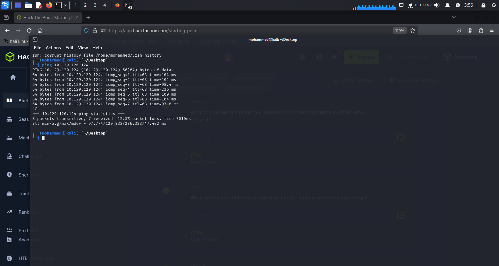
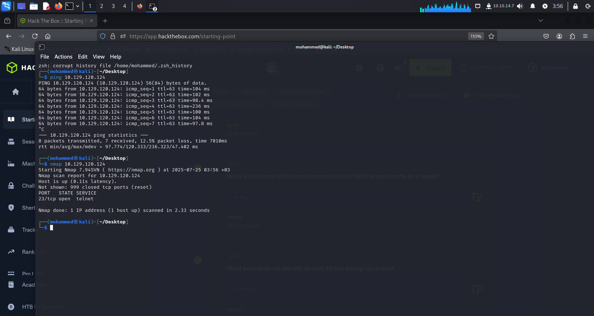
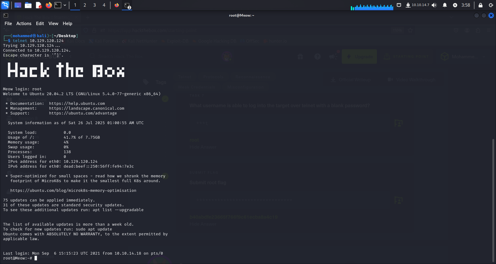
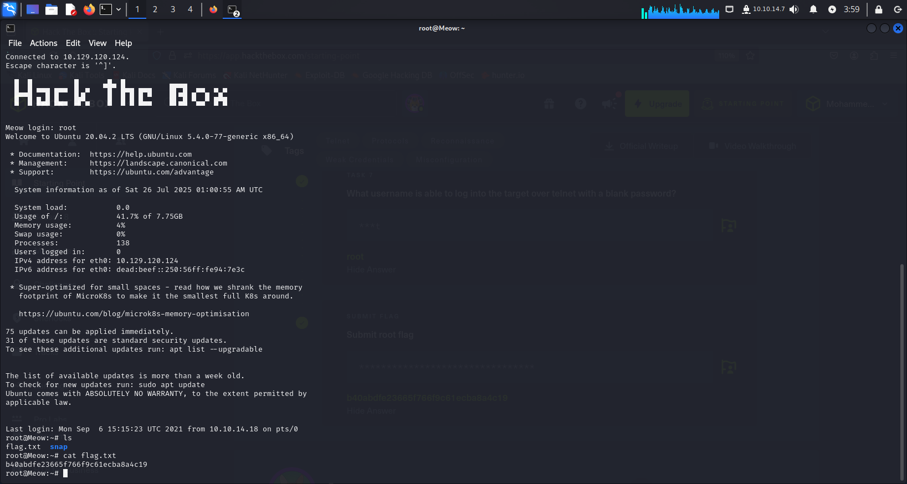

# Hack The Box - Meow

- **Difficulty:** Easy  
- **Category:** Misconfiguration  

---

## 🔍 Vulnerability

Misconfiguration in the **Telnet** service allowed unauthenticated login as `root`.

---

## 🛠️ Tools Used

- `ping`
- `nmap`
- `telnet`

---

## 📸 Screenshots

> Below are the steps with screenshots included.

1. Ping to check connectivity  
   

2. Nmap scan reveals open Telnet port  
   

3. Telnet login as root (no password)  
   

4. Flag extraction  
   

---

## 💡 Notes

- Default Telnet with root access is a major security risk.
- Always disable unused services and enforce authentication.

---
